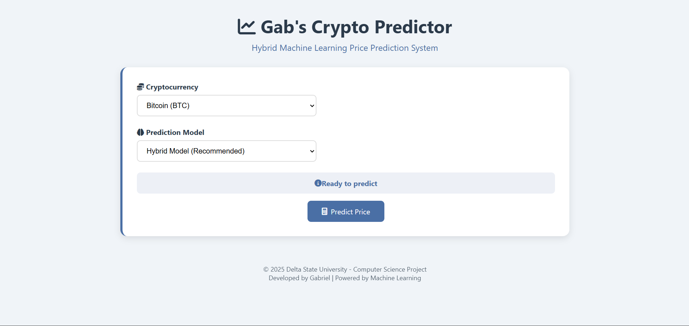

# Gab's Crypto Predictor



A hybrid machine learning system for cryptocurrency price prediction using LSTM and Random Forest models.

## Features

- Real-time price predictions for 24h and 7d timeframes
- Hybrid model combining LSTM and Random Forest
- Confidence scoring for each prediction
- Interactive visualization dashboard
- CoinGecko API integration

## Installation

1. Clone the repository:
   ```bash
   git clone https://github.com/thetruesammyjay/crypto-prediction-app-mvp.git
   cd crypto-prediction-app-mvp
   ```
2. Create and activate virtual environment:
    ```bash
    python -m venv venv
    source venv/bin/activate # Linux/Mac
    venv\Scripts\activate # Windows
    ```
3. Install dependencies:
    ```bash
    pip install -r requirements.txt
    ```
4. Set up environment variables:
    ```bash
    cp .env.example .env
    ```
5. Download pre-trained models and place in models/ directory

## Usage
### Start the prediction server:
```bash
python -m app.app
```
### Access the web interface at:
```text
http://localhost:5000
```

## Project Structure
```text
crypto-predictor/
├── app/               # Flask application
├── models/            # Machine learning models
├── utils/             # Utility functions
├── tests/             # Test cases
├── media/             # Static assets
├── .env.example       # Environment template
├── requirements.txt   # Dependencies
└── README.md          # Project documentation
```

## API Endpoints
- `GET /predict?crypto=<id>&model=<type>` - Get price predictions

    - Parameters:

        - `crypto`: bitcoin, ethereum, etc.

        - `model`: hybrid, lstm, or rf

## Contributing
1. Fork the project

2. Create your feature branch (`git checkout -b feature/AmazingFeature`)

3. Commit your changes (`git commit -m 'Add some amazing feature'`)

4. Push to the branch (`git push origin feature/AmazingFeature`)

5. Open a Pull request

## License
Distributed under the MIT License. See `LICENSE` for more information.

## Contact
- **X (Twitter):** [@thatbwoysammyj](https://x.com/thatbwoysammyj)  
- **Telegram:** [t.me/sammyjayisthename](https://t.me/sammyjayisthename)  
- **Email:** [thetruesammyjay@gmail.com](mailto:thetruesammyjay@gmail.com)
